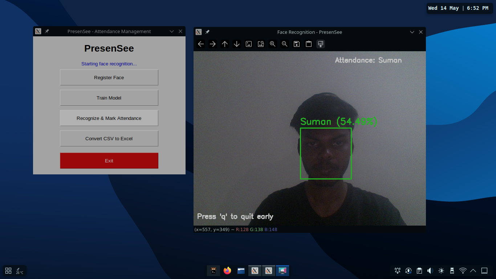

# PresenSee – Face Recognition Attendance System

**PresenSee** is a lightweight face recognition-based attendance management system built using OpenCV.  
It captures and recognizes faces through a webcam and marks attendance automatically in a CSV file. The attendance can later be exported to Excel format for easy viewing and reporting.

This project is intended for **learning and prototyping purposes**, using simple and lightweight models.

---

## Features

- Face registration through webcam with user ID and name input.
- Face detection and recognition using OpenCV’s LBPH model.
- Attendance auto-logged into daily CSV files.
- One-click export of CSV attendance logs to Excel format.
- Prevents duplicate entries per user per day.
- Simple and cross-platform GUI with Python's TKinter.
- Clean and modular file structure.

---

## Getting Started

### 1. Clone the Repository

```bash
git clone https://github.com/your-username/PresenSee.git
cd PresenSee
```

### 2. Create and Activate a Virtual Environment (Recommended)

For Linux/Mac

```bash
python -m venv myvenv 
source myvenv/bin/Activate
```

For Windows

```cmd
python -m venv myvenv
myvenv\Scripts\activate
```

### 3. Install Required Packages

```bash
pip install -r requirements.txt
```

---

## How to Use

### Step 1: Run the GUI Application

```bash
python gui.py
```

### Step 2: Register Face

> Click the **Register Face** button to start face registration.


### Step 3: Enter User Details

> Enter your **User ID** and **User Name** in the popup window and click **Register**.


### Step 4: Face Registration in Progress

> The system will capture multiple face images automatically.


### Step 5: Train the Model

> Click the **Train Model** button to train the face recognition model with registered data.


### Step 6: Mark Attendance

> Click the **Recognize & Mark Attendance** button to start face recognition and attendance marking.



### Step 7: Convert CSV to Excel

> Click the **Convert CSV to Excel** button to export attendance logs as Excel files.


### Step 8: View Attendance

> You can view the Excel files saved in the `database/` folder.


---

## Project Structure

```
PresenSee/
│
├── attendance/               # Stores daily attendance CSVs (auto-generated)
├── database/                 # Stores Excel (.xlsx) exports
├── dataset/
│   └── users/                # User image folders (e.g. 101_John/)
├── models/
│   ├── haarcascade_frontalface_default.xml
│   └── trainer.yml
├── src/core/
│   ├── face_register.py      # Register a new user
│   ├── face_trainer.py       # Train recognition model
│   ├── face_recognition.py   # Detect and mark attendance
│   └── convertToExcel.py     # CSV ➝ Excel converter
├── gui.py                    # Graphical Interface
├── requirement.txt           # Required Packages
└── README.md
```

---

## Requirements

Only the essentials:
```txt
opencv-contrib-python
pandas
numpy
openpyxl
pillow
```

---

## Notes

- Camera auto-closes after a timeout (default: 60 seconds) or if you press `q`.
- Ensure good lighting and clear face visibility for best recognition accuracy.

---

## 👨‍💻 Author

Made with ❤️ for learning and experimentation by [Sumanxhub](https://github.com/Sumanxhub/).
